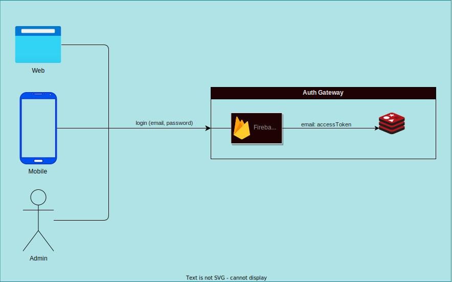
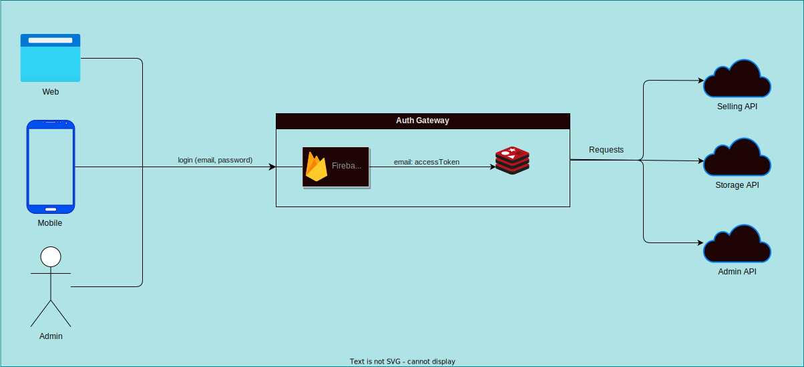

# Bremart Selling System

Este projeto é um microsserviço e parte de um projeto para estudos pessoais. Suas principais responsabilidades são os serviços de compra e registro de usuários. Ele está em desenvolvimento no momento dessa documentação. (20-06-2023)

## Tecnologias e Ferramentas

- [Node.js](https://nodejs.org/en/)
- [TypeScript](https://www.typescriptlang.org/)
- [Jest](https://jestjs.io/)

## Arquitetura, Padrões e Práticas

- [Microsserviços](https://en.wikipedia.org/wiki/Microservices)
- [Arquitetura Limpa](https://blog.cleancoder.com/uncle-bob/2012/08/13/the-clean-architecture.html)
- [Princípios SOLID](https://en.wikipedia.org/wiki/SOLID)
- [TDD](https://en.wikipedia.org/wiki/Test-driven_development)

## Arquitetura

### Autorização e autenticação

#### Sign In

#### Login

## Documentação

A documentação do projeto está destrinchada em quatro partes, seguindo a arquitetura proposta:

- [Domínio](./dominio.md)
- [Aplicação](./aplicacao.md)
- [Adaptadores](./adaptadores.md)
- [Infraestrutura](./infraestrutura.md)
